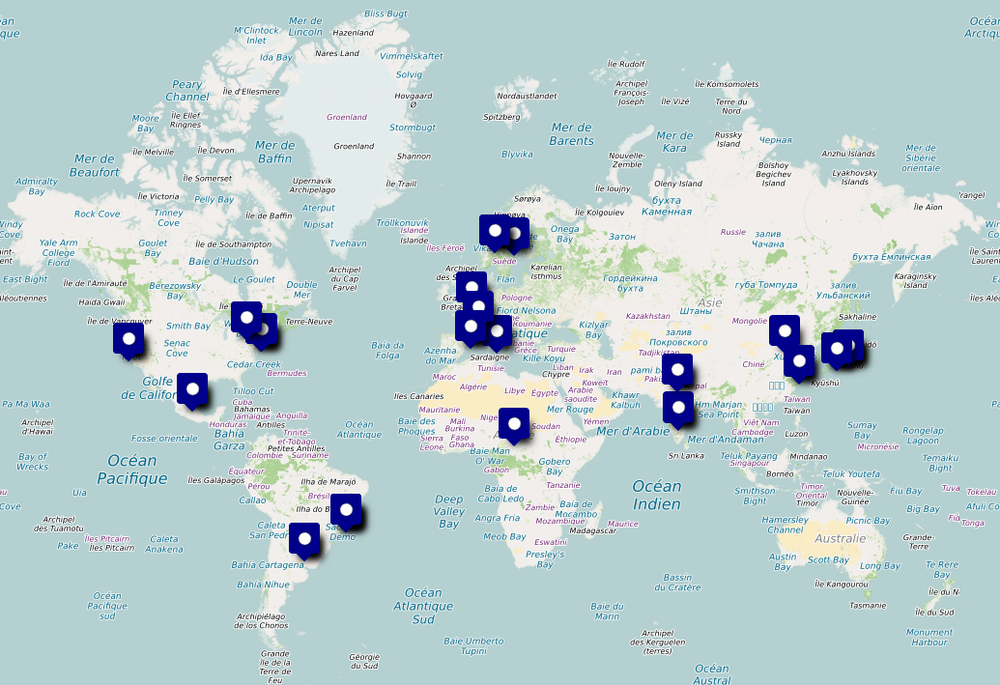

## Querie :

```SQL
SELECT 
    children.first_name,
    elf_plan.x_m,
    elf_plan.y_m
FROM children
INNER JOIN behavior ON behavior.child_id = children.id
INNER JOIN elf_plan ON elf_plan.child_id = children.id
ORDER BY nice_score DESC
LIMIT 38 
```

Ensuite on exporte le tableau en CSV puis on traduit chaque coordonée qui sont actuellement en Lambert pour les traduires en EPSG:3857

voici le resultat après convertion :

| Name | Longitude | Latitude |
| :--- | :-------- | :------- |
| Astrid | 2.3705 | 49.337 |
| Isha | 11.6375 | 37.8925 |
| Omar | -122.4215 | 35.808 |
| Thabo | -43.167 | -23.1165 |
| Sophia | 135.5029 | 32.7483 |
| Freya | 121.4883 | 28.7483 |
| Freya | 2.1542 | 39.429 |
| Lucia | -43.1656 | -23.1311 |
| Chen | 139.6385 | 33.7915 |
| Lucas | -74.0205 | 38.6406 |
| Lucia | 139.6247 | 33.8049 |
| Naledi | -58.3756 | -32.5518 |
| Layla | 10.7337 | 61.1685 |
| Mia | 2.1878 | 39.4639 |
| Nina | 135.5042 | 32.7401 |
| Ines | 121.4939 | 28.7752 |
| Chen | -99.1368 | 19.5703 |
| Isha | 77.6251 | 13.0645 |
| Lucia | -99.1266 | 19.5725 |
| Santiago | 18.0838 | 7.4116 |
| Noah | -79.4005 | 41.7712 |
| Nina | 77.2173 | 26.0655 |
| Sofia | 10.7601 | 61.1772 |
| Isha | -74.0222 | 38.6105 |
| Diego | -43.1895 | -23.1293 |
| Chen | 77.2069 | 26.0628 |
| Emma | 2.3371 | 49.309 |
| Maya | -58.3888 | -32.5113 |
| Olivia | -122.4156 | 35.7952 |
| Sophia | -74.0003 | 38.642 |
| Haruto | -43.1884 | -23.1098 |
| Chloe | 135.5194 | 32.7454 |
| Santiago | 139.6351 | 33.7858 |
| Haruto | 18.0831 | 60.5976 |
| Chloe | 116.4094 | 37.8637 |
| Zainab | -79.4049 | 41.7915 |
| Jie | 77.5982 | 13.0729 |
| Lars | 4.8484 | 4.5772 |

### Dans le site uMap on importe le fichier csv et les pings des enfants apparaissent sur la map

